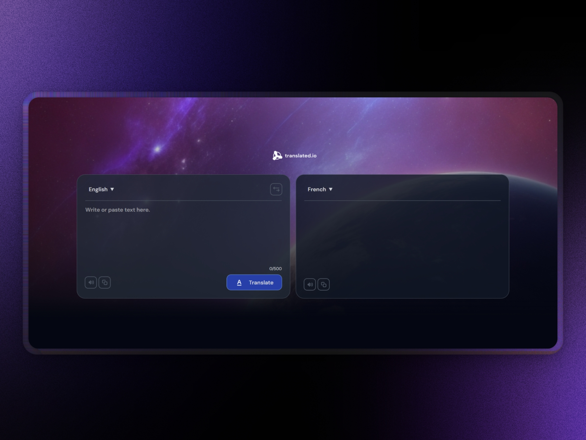

<a name="readme-top"></a>

<div align="center">



# Translate App

Un proyecto web moderno, este es un reto de la plataforma [devchallenges.io](https://devchallenges.io/) adaptado para practicar con **React** y **TypeScript** · [Información del Challenge](https://devchallenges.io/challenge/translate-app)
Este proyecto su idea principal es permitir traducir textos entre múltiples idiomas de forma rápida y eficiente, esto mediante una API pública que permite traducir textos entre múltiples idiomas.

</div>

<details>
<summary>Tabla de contenidos</summary>

- [Translate App](#translate-app)
  - [Tecnologías utilizadas](#tecnologías-utilizadas)
  - [Características](#características)
  - [Estructura del proyecto](#estructura-del-proyecto)
  - [Uso de la API](#uso-de-la-api)
  - [Instalación](#instalación)

</details>

## Tecnologías utilizadas

- [![React][react-badge]][react-url] – Framework de UI
- [![TypeScript][typeScript-badge]][typeScript-url] – Tipado estático
- [![Tailwind][tailwind-badge]][tailwind-url] - Un framework CSS
- [![MyMemory][myMemory-badge]][myMemory-url] – API de traducción

## Características

- Traducción entre múltiples idiomas
- Interfaz de usuario intuitiva y responsiva
- Intercambio rápido de idiomas origen y destino
- Copia del texto traducido al portapapeles
- Diseño moderno y accesible

## Estructura del proyecto

```bash
translate-app/
├── public/
├── src/
│   ├── components/
│   │   ├── TranslateForm/
│   │   ├── LanguageSelector/
│   │   ├── TextArea/
│   │   └── CopyButton/
│   ├── constants/
│   ├── hooks/
│   ├── services/
│   ├── utils/
│   ├── App.tsx
│   ├── index.css
│   ├── main.tsx
│   └── type.d.ts
├── package.json
├── tsconfig.json
├── vite.config.ts
└── README.md
```

## Uso de la API

La API de MyMemory se utiliza para traducir textos entre múltiples idiomas. La API es gratuita para el uso pero esta limitada a 5000 caracteres por dia, pero es posible aumentar el limite a 50000 caracteres por dia proporcionando un correo electronico valido como parametro `('de' parameter)`.

```typescript
async function fetchTranslate({
  q,
  langpair,
}: {
  q: string
  langpair: string
}) {
  const res = await fetch(
    `https://api.mymemory.translated.net/get?q=${encodeURIComponent(
      q
    )}&langpair=${langpair}`
  )
  const data = await res.json()

  return data as TranslateResponse
}
```

## Instalación

Si deseas instalar el proyecto, puedes clonar el repositorio y ejecutar el siguiente comando:

1. Clonar el repositorio

```bash
git clone https://github.com/hrdelarosa/translate-app.git
```

2. Instalar dependencias

```bash
pnpm install
```

3. Ejecutar el proyecto

```bash
pnpm run dev
```

4. Acceder a la aplicacion navegando a http://localhost:5173 o al puerto que se indique en la terminal

<p align="right">(<a href="#readme-top">volver arriba</a>)</p>

[react-url]: https://es.react.dev/
[typescript-url]: https://www.typescriptlang.org/
[tailwind-url]: https://tailwindcss.com/
[myMemory-url]: https://mymemory.translated.net/doc/spec.php
[react-badge]: https://img.shields.io/badge/React-%2320232a.svg?logo=react&logoColor=%2361DAFB
[typescript-badge]: https://img.shields.io/badge/TypeScript-3178C6?logo=typescript&logoColor=fff
[tailwind-badge]: https://img.shields.io/badge/Tailwind%20CSS-%2338B2AC.svg?logo=tailwind-css&logoColor=white
[myMemory-badge]: https://img.shields.io/badge/@MyMemory-API%20technical%20specifications-ff69b4?style=flat-for-the-badge&color=blue
